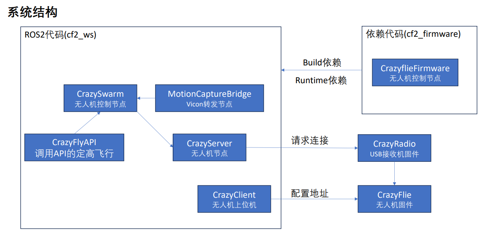
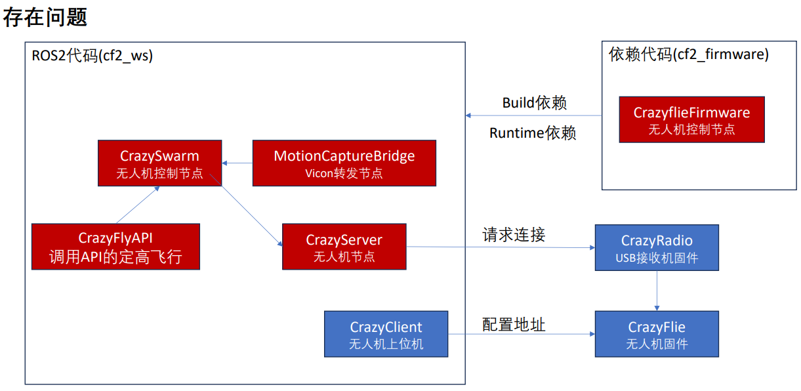

# 0 情况说明
Crazyfile的实验环境草图如下：



- 2024年时，完整的实验流程已经经过调试，可以运行。
- 在本次实验前，红色部分代码被更新，但TAs对此并不知情，导致实验无法复现。
- 


- 方案1: 将红色部分代码版本回退，到2024年调试好的兼容版本；
- 方案2：将未升级部分（Crazyradio+Crazyflie飞控firmware）升级到最新版本，以匹配红色部分，并修复可能出现的新问题
- 方案选择：由于没有做版本记录，尝试回退多个版本均出现兼容性问题（这说明cf2版本兼容做的不好），于是选择方案2

> 备注:
> - 本文内容包括一些方案2中出现的具体问题的解决方案，供参考；
> - 除此之外，后续课程中切记加强实验环境的保护，防止再产生额外的兼容性问题工作量；
> - 本文中的具体问题解决方案主要由几位同学编写，感谢你们的付出，也希望你们有所体验和收获

# 1 主要问题
1、numpy版本在2.x的时候会出现ARRAY NOT FOUND，修改后nicegui仍然不显示

2、需要更新Crazyradio的固件版本

3、飞机有的时候连不上Crazyradio
# 2 问题的主要原因
1、ARRAY NOT FOUND的具体原因是系统库自带matplotlib需要在numpy 1.x的版本下运行，而Crazyfile运行所使用的cflib是要在numpy 2.x版本下才可以运行。所以在将numpy的版本降低到1.x以后nicegui仍然是白屏状态。

2、对于飞机在NUC旁边很难连上Crazyradio的原因是2.4G的信道干扰，将飞机远离NUC即可。

3、运行nice gui问题：在运行 ros2 launch crazyflie launch.py 指令之前需要将cfclient完全关掉（在终端中用ctrl+c关掉，只关掉cflcient 的GUI是不行的），若GUI中飞机为红色时则表示通信没有完全连接，此时cfclient和launch.py在抢飞机的通信。关掉cflient后运行launch.py后GUI中无人机显示为绿色，此时运行ros2 run crazyflie_examples hello_world可以实现飞机起飞。
# 3 解决方法
## 3.1 更新固件

### 3.1.1 Crazyradio
 对于Crazyradio的更新官网上有详细的教程，地址如下：
 
 https://www.bitcraze.io/documentation/tutorials/getting-started-with-crazyradio-2-0/
### 3.1.2 Crazyfile
对于Crazyfile有两种更新的方式，具体如下：

如果能连上Crazyfile（包括但不限于远程、USB直连）请使用方法一，否则请使用方法二。
#### 3.1.2.1 方法一：
在终端输入
```bash
cfclient
```
1、进入cfclient以后按照Session1的步骤先扫描并且连上飞机，如果连接不上请跳转至方法二。

2、点击左上角的**Connect - Bootloader**选项卡，然后进入Crazyfile Service。确保在Crazyfile connection下的Status是Connected。

3.1.1、线上固件更新:在Firmware source下选择cf2平台，Available downloads选择最新的，即2025.12.1版本。

3.2.1、本地固件更新：在下面的网址找到2025.12.1，然后下载**firmware-cf2-2025.12.1.zip**

https://github.com/bitcraze/crazyflie-release/releases

3.2.2、解压文件，找到其中的cf2_2025.12.1.bin。

3.2.3、在Crazyfile Service 中选择From File，找到上面提到的 cf2_2025.12.1.bin，不要选cf2_nrf-xxxx.xx.bin。

4、点击Program按钮进行固件的更新。
#### 3.1.2.2 方法二
此方法仅限于飞机无法连接至cfclient中。

1、在保持USB线未连接的状态下，‌长按Crazyflie板子上的‌复位按钮（Reset Button）。

2、在‌持续按住复位按钮的同时，将USB线的另一端插入电脑的USB端口。

3、继续按住复位按钮约 ‌2-3秒‌，然后松开。

4、此时，Crazyflie的M2的LED指示灯通常会显示特定的蓝灯闪烁模式，表明设备已进入DFU模式。

5、在终端输入
```bash
lsusb
```
6、在输出中寻找下面的设备，如果有这个设备就证明成功进入了Crazyfile的DFU模式。
```bash
ID 0483:df11 STMicroelectronics STM32 Bootloader
```
7、在下面的网址找到2025.12.1，然后下载**firmware-cf2-2025.12.1.zip**

https://github.com/bitcraze/crazyflie-release/releases

8、将压缩包中的**cf2-2025.12.1.bin**解压，解压以后的默认路径应该是
```bash
~/Downloads/cf2-2025.12.1.bin
```
9、在终端输入，注意地址不能输错，万一输错了Crazyfile就成砖了
```bash
sudo dfu-util -d 0483:df11 -a 0 -s 0x08004000 -D ~/Downloads/cf2-2025.12.1.bin
```
10、完成以后将USB从电脑中拔出。

11、将Crazyfile上电，若Crazyfile的M2、M3常亮，M1闪烁红灯，则证明飞机正常重新启动了。

12、然后再插入USB，进入cfclient，扫描，此时应该会出现**usb://0**，这证明Crazyfile已经通过USB连上的电脑。

13、然后再**View - Tools**勾选Console，然后点进Console，查询版本是否已经到了2025.12.1。
## 3.2 解决numpy版本冲突
对于这个这个问题在不删除系统原本的matplotlib的前提下，我将隔离出一个单独环境专门用于Crazyfile的相关编程和运行。
### 3.2.1 安装conda及其环境
#### 3.2.1.1 conda安装
1、安装conda

在终端输入
```bash
wget https://repo.anaconda.com/miniconda/Miniconda3-latest-Linux-x86_64.sh
```
```bash
bash Miniconda3-latest-Linux-x86_64.sh
```
```bash
source ~/.bashrc
```
```bash
conda --version
#如果看到conda 25.x.x则证明安装完成了
```
2、创建conda环境

在终端输入
```bash
git clone https://github.com/F1u0rite/AAE5305_Lab.git
cd AAE5305_Lab
```
```bash
conda env create -f environment.yml
```
3、验证conda环境

在终端输入
```bash
conda env list
#应该能看到两个环境，一个叫base，另一个叫aae5305
```
```bash
conda activate aae5305
```
```bash
which python
```
应该能看到
```bash
~/miniconda3/envs/aae5305/bin/python
```
这证明正常进入到了conda环境中

4、进阶（一般可以不做）

如果不想每次进入终端都进入conda的base环境，请执行以下操作

在终端输入
```bash
cd ~/
code .bashrc
```
在文档的最下面添加
```bash
conda deactivate
```
#### 3.2.1.2 在conda环境下重新编译cf2_ws
建议在重新编译cf2_ws之前在将装在系统中的`cfclient`和`cflib`删除，具体见**3.2.1.4**

在终端输入
```bash
cd ~/cf2_ws
```
```bash
conda activate aae5305
source /opt/ros/humble/setup.bash
```
虽然.bashrc中已经写进了`source /opt/ros/humble/setup.bash`，但是因为我们要在conda环境下编译所以必须要让ros2在conda环境下启动
```bash
rm -rf build install log
```
```bash
colcon build
```
#### 3.2.1.3 尝试运行
具体操作按照Session2的第4、5部分进行操作。
#### 3.2.1.4 删除系统中的`cfclient`和`cflib`
在终端输入
```bash
python3 -m pip uninstall cfclient
```
```bash
python3 -m pip uninstall cflib
```
